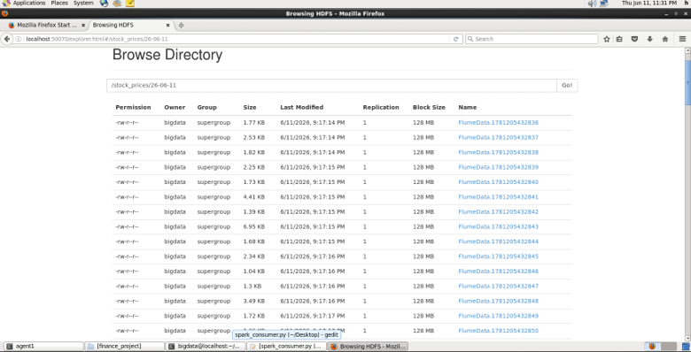
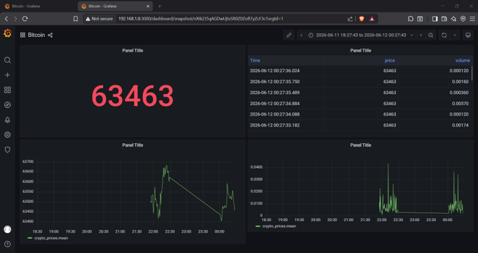

# Real-Time Financial Data Pipeline

A real-time streaming pipeline that ingests live stock/cryptocurrency prices from **Finnhub**, processes them through **Apache Flume → Kafka → PySpark → InfluxDB 1.8**, and visualizes everything on a **Grafana** dashboard. Built and tested on **CentOS 6** with Hadoop, Spark 3.0.1, and Kafka.

---

## Architecture

```
Finnhub WebSocket
       ↓
 Python Producer (websocket-client)
       ↓
 Flume Agent 1 (HTTP Source → Kafka Sink)
       ↓
    Kafka Topic (stock_prices)
       ↓
┌──────┴──────┐
↓              ↓
Flume Agent 2   PySpark Structured Streaming
(Kafka Source   (foreachBatch → InfluxDB 1.8)
 → HDFS)                ↓
                  InfluxDB 1.8
                       ↓
                     Grafana
               (InfluxQL / SQL mode)
```

---

## Components

| Component | Version | Role |
|-----------|---------|------|
| Finnhub API | — | Real-time stock/crypto price feed via WebSocket |
| Python Producer | 2.7+ | WebSocket client that fetches prices and forwards them to Flume via HTTP POST |
| Apache Flume | 1.x | Agent 1: HTTP Source → Kafka Sink; Agent 2: Kafka Source → HDFS Sink |
| Apache Kafka | 2.x | Message broker; topic `stock_prices` |
| PySpark | 3.0.1 | Structured Streaming consumer — parses JSON, flattens arrays, writes to InfluxDB |
| InfluxDB | 1.8 | Time-series database (uses legacy database-name auth, no tokens) |
| Grafana | latest | Visualization dashboard — Time Series, Table, Stat, Logs panels |
| Hadoop HDFS | 2.x | Archival storage via Flume Agent 2 |

---

## Pipeline Flows

### Flow 1: Finnhub → Flume → Kafka → HDFS (Archival)
A Python script subscribes to Finnhub WebSocket for symbols (e.g. `AAPL`, `MSFT`, `BINANCE:BTCUSDT`) and posts every received message to Flume Agent 1's HTTP source on port `44444`. Agent 1 writes to Kafka topic `stock_prices`. Agent 2 reads from that topic and sinks to HDFS at `/user/bigdata/stocks`.

### Flow 2: Kafka → PySpark → InfluxDB → Grafana (Real-Time Analytics)
PySpark Structured Streaming consumes the same Kafka topic, casts binary to string, parses the nested JSON array using an explicit schema, `explode()`s the array into flat rows, and writes each micro-batch to InfluxDB 1.8 using the legacy `influxdb` Python client. Grafana queries InfluxDB with InfluxQL to render live dashboards.

---

## Setup & Execution

### 1. Prerequisites
```bash
# Start Zookeeper & Kafka
zookeeper-server-start.sh config/zookeeper.properties
kafka-server-start.sh config/server.properties
```

### 2. Create Kafka Topic
```bash
kafka-topics.sh --create --zookeeper localhost:2181 \
  --replication-factor 1 --partitions 3 --topic stock_prices
```

### 3. Flume Agent 1 (HTTP → Kafka)
**File:** `finnhub_to_kafka.conf`
```
agent1.sources = s1
agent1.channels = c1
agent1.sinks = k1

agent1.sources.s1.type = http
agent1.sources.s1.bind = 0.0.0.0
agent1.sources.s1.port = 44444

agent1.channels.c1.type = memory
agent1.channels.c1.capacity = 10000

agent1.sinks.k1.type = org.apache.flume.sink.kafka.KafkaSink
agent1.sinks.k1.topic = stock_prices
agent1.sinks.k1.brokerList = localhost:9092

agent1.sources.s1.channels = c1
agent1.sinks.k1.channel = c1
```
```bash
flume-ng agent --conf conf --conf-file finnhub_to_kafka.conf \
  --name agent1 -Dflume.root.logger=INFO,console
```

### 4. Python Producer
```bash
pip install websocket-client requests
```
```python
import websocket, json, requests

TOKEN = "your_finnhub_api_key"
FLUME_URL = "http://localhost:44444"

def on_open(ws):
    ws.send(json.dumps({"type": "subscribe", "symbol": "BINANCE:BTCUSDT"}))

def on_message(ws, message):
    print("RECEIVED:", message)
    try:
        resp = requests.post(FLUME_URL, json=[{"body": message}], timeout=2)
        if resp.status_code == 200:
            print("Sent to Flume")
    except Exception as e:
        print("Flume error:", e)

def on_error(ws, error):
    print("ERROR:", error)

def on_close(ws, close_status_code, close_msg):
    print(f"CLOSED | Status: {close_status_code} | Msg: {close_msg}")

ws = websocket.WebSocketApp(
    f"wss://ws.finnhub.io?token={TOKEN}",
    on_open=on_open, on_message=on_message,
    on_error=on_error, on_close=on_close
)
ws.run_forever()
```
```bash
python producer.py
```

### 5. Flume Agent 2 (Kafka → HDFS)

**File:** `kafka_to_hdfs.conf`
```
agent2.sources = kafkaSource
agent2.channels = memoryChannel
agent2.sinks = hdfsSink

agent2.sources.kafkaSource.type = org.apache.flume.source.kafka.KafkaSource
agent2.sources.kafkaSource.kafka.bootstrap.servers = localhost:9092
agent2.sources.kafkaSource.kafka.topics = stock_prices

agent2.channels.memoryChannel.type = memory

agent2.sinks.hdfsSink.type = hdfs
agent2.sinks.hdfsSink.hdfs.path = hdfs://localhost:8020/user/bigdata/stocks
agent2.sinks.hdfsSink.hdfs.filePrefix = stock
agent2.sinks.hdfsSink.hdfs.fileType = DataStream

agent2.sources.kafkaSource.channels = memoryChannel
agent2.sinks.hdfsSink.channel = memoryChannel
```
```bash
hdfs dfs -mkdir -p /user/bigdata/stocks
flume-ng agent --conf conf --conf-file kafka_to_hdfs.conf \
  --name agent2 -Dflume.root.logger=INFO,console
```

### 6. PySpark Consumer (Kafka → InfluxDB 1.8)
```bash
pip install influxdb
```
```python
from pyspark.sql import SparkSession
from pyspark.sql.functions import col, from_json, explode
from pyspark.sql.types import *
from influxdb import InfluxDBClient

INFLUX_HOST, INFLUX_PORT, INFLUX_DB = "localhost", 8086, "stock_database"

client = InfluxDBClient(host=INFLUX_HOST, port=INFLUX_PORT)
client.create_database(INFLUX_DB); client.close()

trade_schema = StructType([
    StructField("data", ArrayType(StructType([
        StructField("p", DoubleType()), StructField("s", StringType()),
        StructField("t", LongType()), StructField("v", DoubleType())
    ]))),
    StructField("type", StringType())
])

spark = SparkSession.builder.appName("KafkaToInfluxDB").getOrCreate()
spark.sparkContext.setLogLevel("WARN")

kafka_df = spark.readStream.format("kafka") \
    .option("kafka.bootstrap.servers", "localhost:9092") \
    .option("subscribe", "stock_prices") \
    .option("startingOffsets", "earliest").load()

parsed = kafka_df.selectExpr("CAST(value AS STRING) as json") \
    .withColumn("data", from_json(col("json"), trade_schema)) \
    .select("data.data")

flattened = parsed.withColumn("trade", explode(col("data"))).select(
    col("trade.s").alias("symbol"), col("trade.p").alias("price"),
    col("trade.v").alias("volume"), col("trade.t").alias("timestamp"))

def write_to_influx(batch_df, batch_id):
    rows = batch_df.collect()
    if not rows: return
    client = InfluxDBClient(host=INFLUX_HOST, port=INFLUX_PORT, database=INFLUX_DB)
    points = [{
        "measurement": "crypto_prices",
        "tags": {"symbol": str(r.symbol).replace(" ", "")},
        "time": int(r.timestamp) * 1_000_000,
        "fields": {"price": float(r.price or 0), "volume": float(r.volume or 0)}
    } for r in rows if r.timestamp]
    if points:
        client.write_points(points, batch_size=500, time_precision="n")
        print(f"Batch {batch_id}: wrote {len(points)} records")
    client.close()

query = flattened.writeStream.foreachBatch(write_to_influx).start()
query.awaitTermination()
```
```bash
ulimit -u 4096
spark-submit --master local[2] --driver-memory 1g --executor-memory 1g \
  --packages org.apache.spark:spark-sql-kafka-0-10_2.12:3.0.1 \
  spark_consumer.py
```

### 7. Grafana Dashboard


**URL:** `http://<vm-ip>:3000` (default: `admin / admin`)

**Data Source:** InfluxDB 1.8 — URL `http://localhost:8086`, Database `stock_database`

**Sample InfluxQL Queries:**

| Panel Type | Query |
|-----------|-------|
| Time Series | `SELECT mean("price") FROM "crypto_prices" WHERE $timeFilter GROUP BY time($__interval)` |
| Stat (current price) | `SELECT last("price") FROM "crypto_prices" WHERE $timeFilter` |
| Table | `SELECT "price", "volume" FROM "crypto_prices" WHERE $timeFilter ORDER BY time DESC` |
| Logs | `SELECT "price" AS "Price", "volume" AS "Volume" FROM "crypto_prices" WHERE $timeFilter` |
| Gauge (volume) | `SELECT sum("volume") FROM "crypto_prices" WHERE $timeFilter` |

---

## Troubleshooting

| Issue | Cause | Solution |
|-------|-------|----------|
| `401 Unauthorized` from Finnhub | Invalid/expired API key | Generate a new key at finnhub.io |
| `on_close() takes 1 positional argument but 3 were given` | Modern `websocket-client` expects 3 args | Use `def on_close(ws, *args)` or 3-param signature |
| `zookeeper is not a recognized option` | Kafka 2.5+ removed `--zookeeper` for consumers | Use `--bootstrap-server localhost:9092` |
| `java.lang.OutOfMemoryError: unable to create new native thread` | CentOS 6 default `ulimit -u = 1024` is too low for Spark | Run `ulimit -u 4096`; set `nproc 4096` in `/etc/security/limits.d/90-nproc.conf` |
| `StreamingQueryException: useDeprecatedKafkaOffsetFetching()` | spark-sql-kafka package version does not match Spark version | Use exact matching version (`spark-sql-kafka-0-10_2.12:3.0.1` for Spark 3.0.1) |
| `BrokenPipeError` / `Connection aborted` | Sending InfluxDB v2 API format to InfluxDB 1.8 | Switch to legacy `influxdb` Python client with `host`/`port`/`database` |
| Flume `IllegalStateException: Running HTTP Server found` | Port 44444 already in use | `kill -9 $(lsof -ti :44444)` or change port in config |
| Grafana "Your browser is not fully supported" | Browser on CentOS 6 is too old | Open Grafana from a modern browser on the host machine at `http://<vm-ip>:3000` |
| `ImportError: cannot import name 'stringify'` | `stringify` does not exist in pyspark.sql.functions | Use `CAST(value AS STRING)` in SQL expression instead |
| Python producer exits immediately with no output | Network/SSL issue on old CentOS, or WebSocket library missing | Verify with `curl` to Finnhub; check Python & library versions |

---

## Project Structure

```
~/finance_project/
├── producer.py                 # Finnhub WebSocket → Flume HTTP
├── Agent_1.conf       # Flume Agent 1 config
├── Agent_2.conf          # Flume Agent 2 config
├── spark_consumer.py           # PySpark Kafka → InfluxDB
└── README.md
```

---

## Requirements

- CentOS 6 / 7
- Python 2.7+ or 3.x with `websocket-client`, `requests`, `influxdb`
- Apache Flume 1.x
- Apache Kafka 2.x
- Apache Spark 3.0.1 (with `spark-sql-kafka-0-10_2.12:3.0.1`)
- InfluxDB 1.8
- Grafana (latest)
- Hadoop HDFS (optional, for archival)


